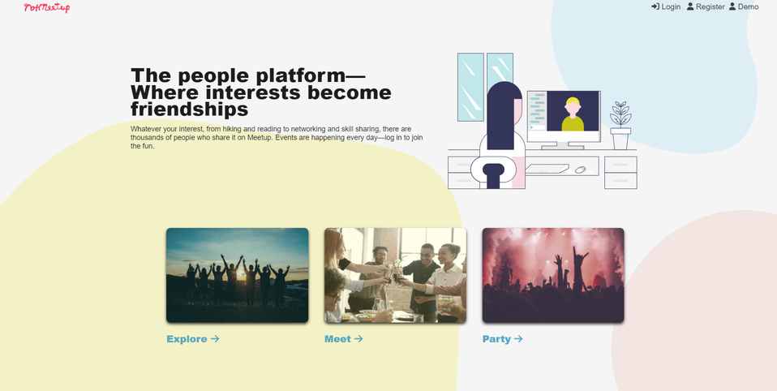
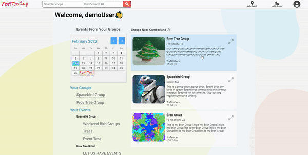
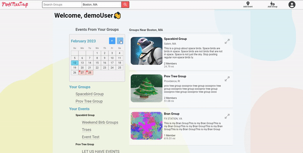
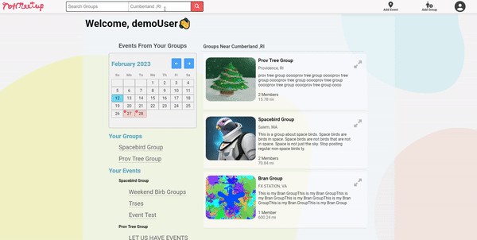
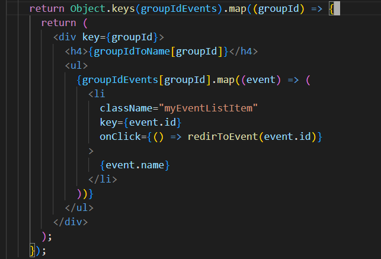
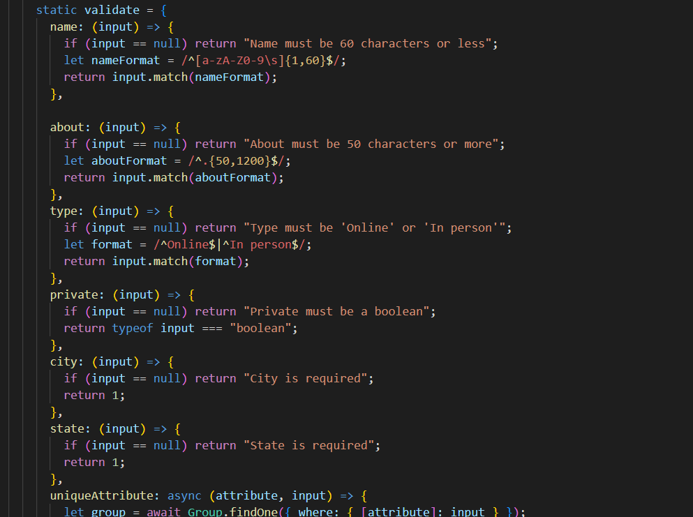
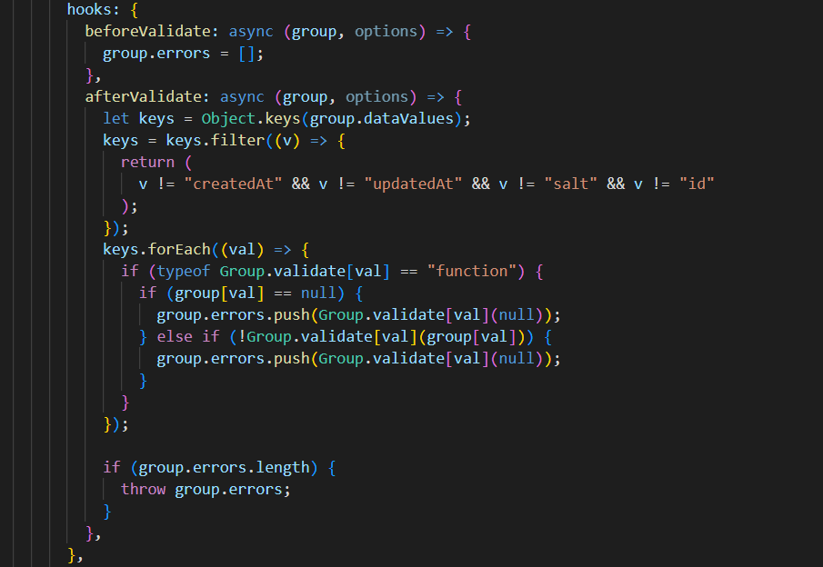

# NotMeetup

Live Site: https://haskjdhashdasd9.onrender.com

Backend: https://github.com/brandonetter/MeetUp/tree/main/server

### Summary Of Features: This is a partial clone of the website Meetup.com, some of the features include --

- **Google Maps Integration**

  - Using _DistanceMatrix_ to grab the Distance between Groups and Search Locations
  - Using the _Map_ to allow using to select locations through clicking
  - Grabbing detailed information about the _User's Location_
  - Displaying _Markers_ on relevant points of interest

- **Authentication**

  - Session management using JSON Web Tokens
  - Cross Site Request Forgery (CSRF) Protection

- **Database**
  - Sequelize ORM
  - Data validation on server-side
  - Image upload using Multer
- **FrontEnd**
  - Built using React
  - Calendar Widget for selecting Dates and Displaying upcoming Events
  - Image Carousel
  - Animation of Background using SVG animations
  - Loading Images for smooth User Experience

### Screenshots:

### Build And Run Instructions:

1.  git clone this repo
2.  `cd Meetup && npm run full-install`
3.  `npm run start` or `npm run dev`

### Tech:

- React
- Redux
- NodeJS
  - Express
  - JSON Web Tokens
  - BCrypt
  - Multer
- Sequelize ORM
  - SQLite3
  - Postgres
- CSS HTML
- Javascript
- Google Maps API

### Todo:

- Add User Profiles and User Image Uploads
- Add Moderator Controls
- Add Mobile Site
- Email Notifications and Subscriptions
- Toasts and Notifcations
- Add Messaging and Group Chats Using SocketIO

### Personal Notes:

I really learned a lot about project management with this one, as it was my biggest solo project in Web Dev. **Key take-aways for me** are--

- Your test environment should be as close to you deploy environment as you can manage
- Naming conventions and project structure are critically important to development speed once the project grows to a certain size.
- Be comfortable with deleting and rewriting small parts of the backend once the front-end seems to demand it.

I picked up a few programming patterns I'd like to continue using in future projects.
Like using **React's** map along-side `Object.keys`To iterate through Objects containing Arrays with in-line JSX

Or like integrating data validation inside of Sequelize Models to make a clean and self-contained system

...

